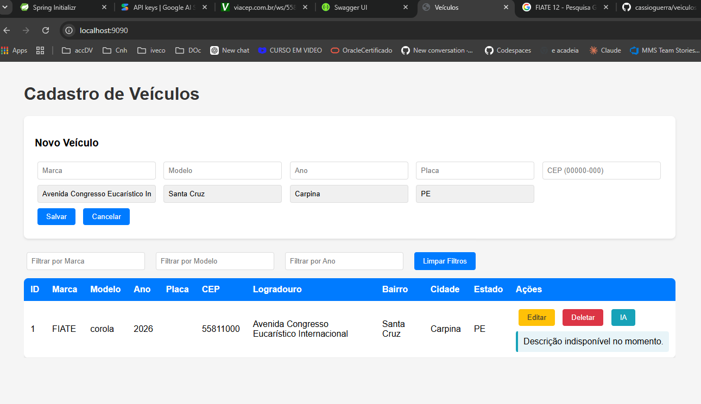
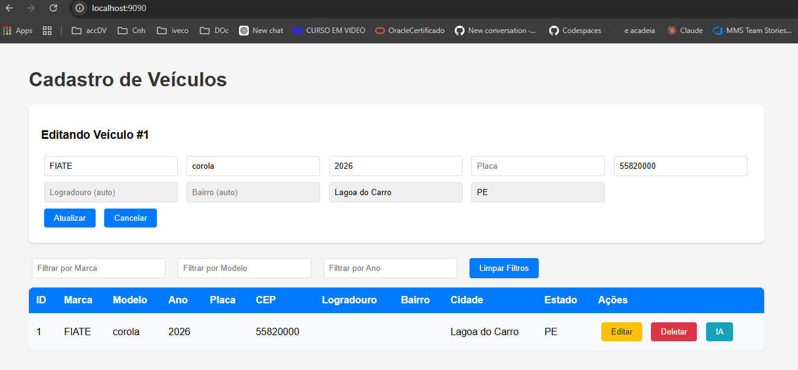
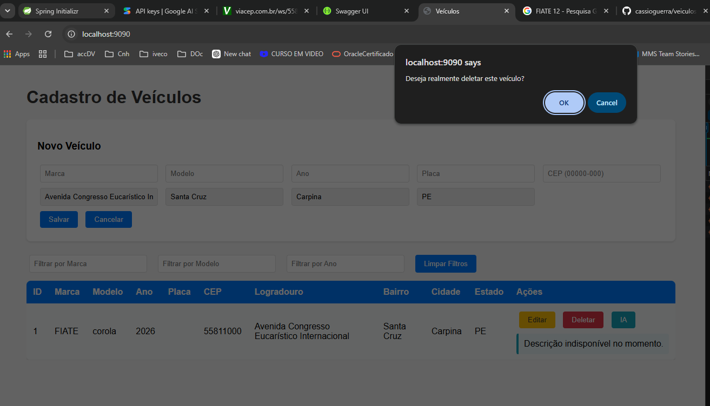
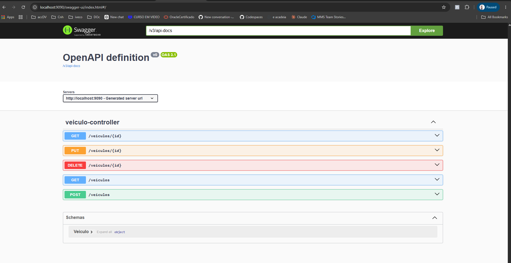
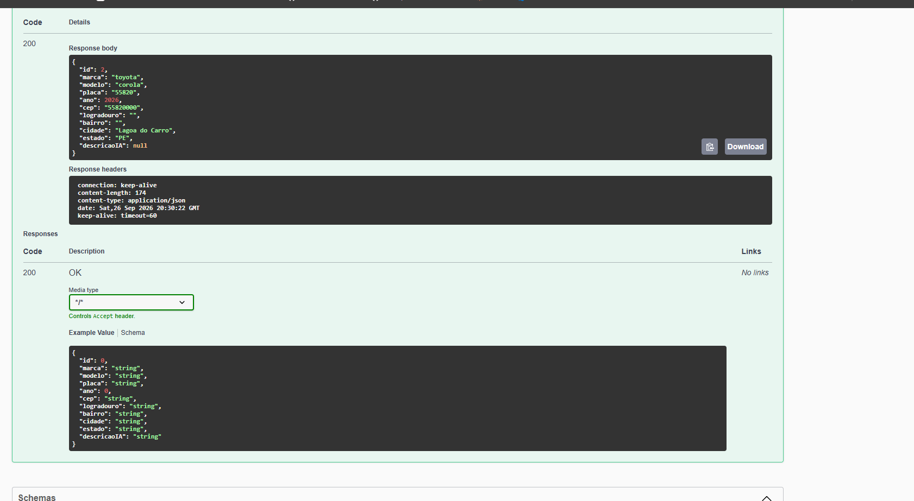
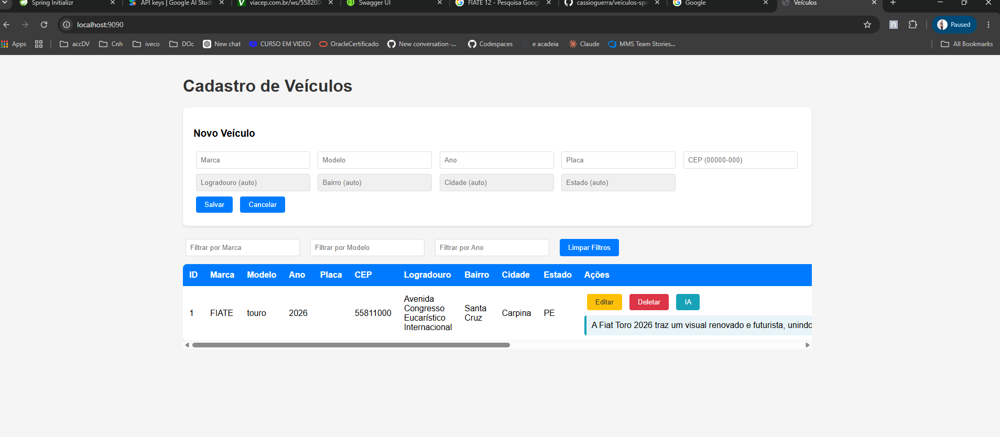

# Cadastro de Veículos — Spring Boot

Projeto desenvolvido em Java com Spring Boot para gerenciamento de veículos, com integração ao ViaCEP para preenchimento automático de endereço e ao Google Gemini AI para geração de descrições inteligentes.

---

## Tecnologias Utilizadas

| Tecnologia | Versão | Finalidade |
|---|---|---|
| Java | 25 | Linguagem principal |
| Spring Boot | 4.1.1 | Framework web |
| H2 Database | In-memory | Banco de dados em memória |
| Spring Data JPA | — | Persistência de dados |
| SpringDoc / Swagger | 2.8.8 | Documentação da API |
| JUnit 5 + Mockito | — | Testes automatizados |
| ViaCEP | REST externo | Busca de endereço por CEP |
| Google Gemini AI | gemini-3.8-flash | Descrição inteligente do veículo |

---

## Arquitetura em 4 Camadas

```
Controller  ←→  Service  ←→  Repository  ←→  H2 (banco em memória)
    ↑                ↑
 index.html     GeminiService / ViaCepService
```

| Camada | Classe | Responsabilidade |
|---|---|---|
| Entidade | `Veiculo.java` | Mapeamento da tabela no banco |
| Repositório | `VeiculoRepository.java` | Acesso ao banco via JPA |
| Serviço | `VeiculoService.java` | Regras de negócio |
| Controlador | `VeiculoController.java` | Endpoints REST |

---

## Funcionalidades

- **CRUD completo** — Criar, listar, buscar, editar e deletar veículos
- **CEP automático** — Ao digitar o CEP, preenche logradouro, bairro, cidade e estado via ViaCEP
- **IA Gemini** — Botão "IA" gera descrição do veículo em 2 frases usando Google Gemini
- **Filtros em tempo real** — Filtra a tabela por marca, modelo e ano sem recarregar a página
- **Frontend embutido** — Interface HTML/CSS/JS servida pelo próprio Spring Boot em `/`
- **Swagger UI** — Documentação interativa da API em `/swagger-ui.html`
- **H2 Console** — Console web do banco em `/h2-console`

---

## Como Executar

### Pré-requisitos
- Java 25+
- Maven 3.x (ou usar o Eclipse com Spring Tools)

### 1. Clonar o repositório
```bash
git clone <url-do-repositorio>
cd Veiculo
```

### 2. Configurar a chave do Gemini
Abra o arquivo `src/main/resources/application.properties` e substitua o placeholder pela sua chave:

```properties
gemini.api.key=SUA_CHAVE_AQUI
```

Gere sua chave gratuita em: https://aistudio.google.com/apikey

### 3. Executar
```bash
mvn spring-boot:run
```

Ou pelo Eclipse: **Boot Dashboard → Start**

### 4. Acessar
| URL | Descrição |
|---|---|
| http://localhost:9090 | Frontend principal |
| http://localhost:9090/swagger-ui.html | Swagger / documentação |
| http://localhost:9090/h2-console | Console do banco H2 |

**Configuração do H2 Console:**
- JDBC URL: `jdbc:h2:mem:veiculosdb`
- Usuário: `sa`
- Senha: *(vazio)*

---

## Endpoints da API REST

| Método | Endpoint | Descrição |
|---|---|---|
| GET | `/veiculos` | Lista todos os veículos |
| GET | `/veiculos/{id}` | Busca veículo por ID (inclui descrição IA) |
| POST | `/veiculos` | Cria novo veículo |
| PUT | `/veiculos/{id}` | Atualiza veículo existente |
| DELETE | `/veiculos/{id}` | Remove veículo |

### Exemplo de requisição (POST /veiculos)
```json
{
  "marca": "Toyota",
  "modelo": "Corolla",
  "ano": 2023,
  "placa": "ABC1234",
  "cep": "01310100"
}
```

### Exemplo de resposta com CEP preenchido
```json
{
  "id": 1,
  "marca": "Toyota",
  "modelo": "Corolla",
  "ano": 2023,
  "placa": "ABC1234",
  "cep": "01310100",
  "logradouro": "Avenida Paulista",
  "bairro": "Bela Vista",
  "cidade": "São Paulo",
  "estado": "SP",
  "descricaoIA": null
}
```

### Exemplo de resposta com IA (GET /veiculos/1)
```json
{
  "id": 1,
  "marca": "Toyota",
  "modelo": "Corolla",
  "ano": 2023,
  "descricaoIA": "O Toyota Corolla 2023 é um sedã compacto reconhecido pela sua confiabilidade e tecnologia moderna. Ele oferece um interior espaçoso e econômico, sendo uma das escolhas mais populares do mercado."
}
```

---

## Evidências de Funcionamento

### Frontend — Tela principal com veículo cadastrado e CEP preenchido automaticamente


### Frontend — Modo edição com CEP auto-preenchido


### Frontend — Confirmação de exclusão


### Swagger UI — Todos os endpoints documentados


### Swagger — Resposta real do GET /veiculos com dados persistidos


### Gemini AI — Descrição gerada no frontend (botão IA)


### Gemini AI — Resposta real via GET /veiculos/1
Resposta da API com `descricaoIA` preenchida pelo Google Gemini:

```json
{
  "id": 1,
  "marca": "Toyota",
  "modelo": "Corolla",
  "placa": null,
  "ano": 2023,
  "cep": "01310100",
  "logradouro": "Avenida Paulista",
  "bairro": "Bela Vista",
  "cidade": null,
  "estado": "SP",
  "descricaoIA": "O Toyota Corolla 2023 é um sedã médio reconhecido por sua durabilidade, conforto e confiabilidade mecânica. O modelo se destaca pelas econômicas versões híbridas e pelo avançado pacote de tecnologias de segurança."
}
```

---

## Testes Automatizados

**17 testes — 0 erros — 0 falhas**

| Classe de Teste | Testes | Cobertura |
|---|---|---|
| `VeiculoServiceTest` | 8 | Criar, listar, buscar, atualizar, deletar (com e sem CEP) |
| `VeiculoControllerTest` | 5 | Todos os endpoints HTTP (GET, POST, PUT, DELETE) |
| `GeminiServiceTest` | 3 | Fallback com API key vazia, exceção de conexão, dados variados |

### Evidência dos testes passando
```
Tests run: 17, Failures: 0, Errors: 0, Skipped: 0
```

Anotações utilizadas:
- `@ExtendWith(MockitoExtension.class)` — ativa injeção de mocks no Mockito
- `@WebMvcTest` — contexto Spring MVC para testes de controller
- `@MockitoBean` — mock de dependências no contexto Spring Boot 4.x
- `@InjectMocks` — injeta mocks no serviço sendo testado

---

## Estrutura do Projeto

```
src/
├── main/
│   ├── java/com/example/Veiculo/
│   │   ├── VeiculoApplication.java       # Ponto de entrada + bean RestTemplate
│   │   ├── controller/
│   │   │   └── VeiculoController.java    # Endpoints REST
│   │   ├── entidade/
│   │   │   └── Veiculo.java              # Entidade JPA (@Transient em descricaoIA)
│   │   ├── repository/
│   │   │   └── VeiculoRepository.java    # Interface JPA
│   │   └── service/
│   │       ├── VeiculoService.java       # Regras de negócio + integração ViaCEP
│   │       ├── GeminiService.java        # Integração Google Gemini AI
│   │       └── ViaCepResposta.java       # DTO da resposta do ViaCEP
│   └── resources/
│       ├── application.properties        # Configurações do banco e API
│       └── static/
│           └── index.html                # Frontend completo
└── test/
    └── java/com/example/Veiculo/
        ├── controller/VeiculoControllerTest.java
        └── service/
            ├── VeiculoServiceTest.java
            └── GeminiServiceTest.java
```

---

## Observações Técnicas

- **`descricaoIA` é `@Transient`** — não é salvo no banco, gerado dinamicamente a cada consulta por ID
- **CEP é armazenado** apenas os 8 dígitos (sem hífen), o endereço é preenchido na criação via ViaCEP
- **H2 é in-memory** — os dados são perdidos ao reiniciar o servidor (comportamento esperado para desenvolvimento)
- **Chave Gemini gratuita** — limite de 20 requisições/dia por projeto no plano gratuito
